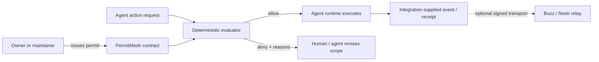

# PermitMesh

[](https://github.com/JalenBuildsHub/PermitMesh/actions/workflows/ci.yml)

**A portable policy-decision profile for AI agents changing software.**

> **PDP, not PEP.** PermitMesh evaluates policy. It does not authenticate an
> issuer, sandbox an agent, intercept tools, or enforce its decisions.

PermitMesh is an independent, experimental software-change profile and
conformance suite. It is not affiliated with or endorsed by Block, Buzz, the
IETF, or any standards body.

A PermitMesh contract states:

- who authorized the agent;
- which repository, ref, channel, and paths it may touch;
- which actions it may perform;
- the exact tool and arguments approved for each high-risk action;
- its file, command, time, and cost limits;
- which actions require human approval;
- which live claim and fencing generation it belongs to;
- which one-time operation nonce the enforcement point must consume; and
- what proof must exist before the work is complete.

The reference CLI evaluates proposed actions deterministically and fails closed with a machine-readable explanation.

> Status: **HYPOTHESIS — NOT ADOPTED.** Version 0.2 is a local
> interoperability experiment, not a security boundary.

## Why this exists

[Buzz](https://github.com/block/buzz) gives people and agents cryptographic
identities in a shared event stream. PermitMesh independently explores a
complementary policy layer for software-changing agents:

> **Identity says who acted. A software-work permit describes the boundary
> an enforcement point should apply.**

PermitMesh adds work-shaped constraints that an execution boundary can apply:
paths, actions, budgets, approval gates, claims, and fencing generations. It
does not assume that Buzz will adopt this format or that identity alone
supplies trusted authorization facts.

PermitMesh does not fork Buzz, replace Nostr identity, or claim to be an accepted Buzz protocol. It is transport-neutral and includes an experimental adapter that turns a valid permit into an **unsigned** Nostr application-data event template.

This is a narrow profile, not a claim to have invented fine-grained
authorization. OAuth RAR, OPA, Cedar, Macaroons, Biscuit, ZCAP-LD, SPIFFE, MCP,
and several 2026 agent-authorization drafts cover adjacent or deeper layers.
See the candid [prior-art matrix](docs/PRIOR_ART.md).

## Thirty-second demo

Requires Python 3.11+ and no runtime dependencies.

```powershell
$env:PYTHONPATH = "$PWD\src"

# Contract shape is valid.
python -m permitmesh validate examples\contract.valid.json

# An in-scope edit is allowed.
python -m permitmesh authorize examples\contract.valid.json examples\request.allowed.json --evaluation-time 2026-07-23T12:00:00Z

# A protected deploy with no exact operation binding, a stale claim,
# wrong ref, forbidden path, exceeded budgets, and no approval is denied.
python -m permitmesh authorize examples\contract.valid.json examples\request.denied.json --evaluation-time 2026-07-23T12:00:00Z
```

The allowed request returns:

```json
{
  "allowed": true,
  "violations": []
}
```

The denied request reports all ten violations, including:

```json
{
  "allowed": false,
  "violations": [
    "request.operation is required for high-risk action 'deploy'",
    "request.operation_nonce must be 16-128 safe characters",
    "ref 'main' is outside scope",
    "path '.env' matches a deny rule",
    "claim_id does not match the active contract",
    "fencing_generation does not match the active contract",
    "action 'deploy' requires 1 approval(s) from the configured approvers"
  ]
}
```

Run the complete reproducible demo:

```powershell
.\scripts\demo.ps1
```

Run the 27-case adversarial conformance suite and save a receipt:

```powershell
permitmesh conformance examples\conformance-suite.json `
  --receipt validation\conformance-local.json
```

The suite covers subject and channel mismatch, unknown and malformed actions,
root-anchored path and ref glob edges, traversal and non-canonical paths,
duplicate JSON keys, exact decimal budgets, malformed approvals, stale claims
and fences, exact high-risk operation binding, replayed operation nonces,
validity boundaries, unknown fields, non-finite input, and required completion
evidence.

## How it fits



PermitMesh is the policy decision point. The runtime, relay, or tool proxy remains the enforcement point. A JSON file sitting beside an unrestricted agent does not enforce anything.

## Commands

```text
permitmesh validate <contract>
permitmesh digest <contract>
permitmesh authorize <contract> <request> [--evaluation-time RFC3339]
permitmesh verify-completion <contract> <report> [--evaluation-time RFC3339]
permitmesh to-event <contract> [--created-at UNIX_SECONDS]
permitmesh conformance <suite> [--receipt PATH] [--enforcement-boundary TEXT]
```

All decision output is JSON. Exit codes are `0` for success/allow, `2` for
malformed input or an invalid contract, `3` for a well-formed but denied
request, and `4` for a conformance suite with failed cases.

`--evaluation-time` exists for deterministic tests, replay, and trusted enforcement adapters. Never populate it from an agent-controlled field.

## Contract surface

The v0.2 contract, request, completion-report, and conformance-receipt schemas
live in [`schema/`](schema). The reference evaluator additionally checks
cross-document and semantic rules JSON Schema cannot express cleanly:

- the validity window is ordered and active;
- paths and path patterns are relative and traversal-free, with ambiguous
  Windows drive, ADS, reserved-name, trailing-dot/space, and DOS short-name
  spellings rejected;
- path and ref globs are root-anchored; `*` matches one segment and `**`
  recursively matches segments;
- deny patterns override allow patterns;
- repository and ref scope match;
- consumption stays within declared budgets;
- the live claim and fencing generation match;
- high-risk actions match a preapproved action, tool, arguments digest, and
  one-time nonce;
- approval thresholds are possible and satisfied.

In v0.2, `shell`, `test`, `commit`, `deploy`, `publish`, and `spend` are
high-risk capabilities and require that exact operation binding.

The strict loader rejects duplicate object keys and non-standard numeric
constants, and preserves decimal precision for budget comparisons. The digest
is SHA-256 over canonical JSON with `signature` and `contract_digest` excluded.
This digest binds receipts and transport adapters to the effective policy
document. `permitmesh digest` refuses structurally invalid contracts.

## Buzz/Nostr adapter

```powershell
python -m permitmesh to-event examples\contract.valid.json --created-at 1784800000
```

This emits an envelope containing a NIP-78-style kind `30078` template with a deterministic `d` tag and contract digest. The issuer `pubkey` is present while `id` and `sig` are deliberately blank. A Buzz/Nostr integration must compute the NIP-01 event ID, sign with the issuer's key, and validate that signature before treating it as authorization.

The adapter is exploratory. An upstream design conversation should decide whether capability contracts belong in application data, a Buzz-specific kind, or a broader NIP.

## Trust boundaries

- PermitMesh 0.2 validates policy; it does not sandbox tools.
- Signature metadata may be carried, but the reference CLI does not verify signatures yet.
- `request.at` is receipt metadata only and never controls authorization time. The evaluator uses its own clock; a production adapter must ensure that clock is trustworthy.
- A fencing generation is useful only if the resource being protected rejects stale generations.
- High-risk authorization requires explicit consumed-nonce state. The Python
  evaluator checks that state but does not mutate it. A real enforcement point
  must atomically reserve or consume the approved nonce and execute the exact
  tool-and-arguments operation, or another worker could reuse the same
  authorization decision.
- A relay storing a permit does not imply that an execution runtime enforced it.

See [docs/THREAT_MODEL.md](docs/THREAT_MODEL.md) for the explicit boundary.

## Development

```powershell
$env:PYTHONPATH = "$PWD\src"
python -m unittest discover -s tests -v
python -m compileall -q src tests
```

## What success means

Stars are discovery, not success. The initial North Star is **verified external authorization runs**: an external maintainer executes both an allowed and a deliberately denied action against their own real agent workflow, retains the decision receipt, and reports whether the result matched intent.

The first target is five verified runs across at least two external teams, with zero known false allows.

See [docs/NORTH_STAR.md](docs/NORTH_STAR.md) for the evidence, anti-goals, and staged campaign.
External maintainers can [report a conformance run](https://github.com/JalenBuildsHub/PermitMesh/issues/new?template=conformance-run.yml)
after removing secrets and sensitive workspace details.

## Project status

PermitMesh is an independent Jalen Studio experiment. Publication is meant to
test whether the narrow software-change profile is useful. A Buzz design
discussion remains gated on independent reproduction; publication alone does
not justify an upstream proposal.

Apache-2.0.
