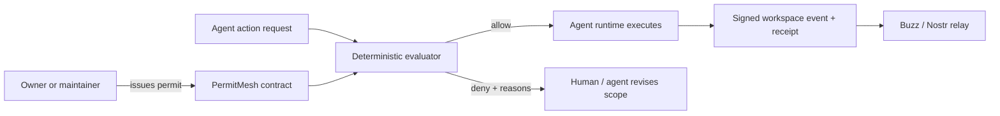

# PermitMesh

**Agents should not receive a vague prompt and a powerful shell. They should receive a verifiable permit.**

PermitMesh is an experimental, open capability-contract format for AI agents working alongside people. A permit states exactly:

- who authorized the agent;
- which repository, ref, channel, and paths it may touch;
- which actions it may perform;
- its file, command, time, and cost limits;
- which actions require human approval;
- which live claim and fencing generation it belongs to; and
- what proof must exist before the work is complete.

The reference CLI evaluates proposed actions deterministically and fails closed with a machine-readable explanation.

> Status: **HYPOTHESIS — NOT ADOPTED.** Version 0.1 is a local proof, not a security boundary by itself.

## Why this exists

[Buzz](https://github.com/block/buzz) gives people and agents the same cryptographic identity and puts their work in one signed event stream. Its own roadmap calls out tighter agent scoping as important future work.

PermitMesh explores a complementary layer:

> **Buzz makes every agent a member. PermitMesh makes every action answer to an exact contract.**

Buzz's draft owner-attestation proposal proves which owner authorized an agent key and can restrict event kinds or self-declared timestamps. It explicitly does not provide trusted wall-clock expiry. PermitMesh adds the work-shaped constraints that an execution boundary needs: paths, actions, budgets, approval gates, claims, and fencing generations.

PermitMesh does not fork Buzz, replace Nostr identity, or claim to be an accepted Buzz protocol. It is transport-neutral and includes an experimental adapter that turns a valid permit into an **unsigned** Nostr application-data event template.

## Thirty-second demo

Requires Python 3.11+ and no runtime dependencies.

```powershell
$env:PYTHONPATH = "$PWD\src"

# Contract shape is valid.
python -m permitmesh validate examples\contract.valid.json

# An in-scope edit is allowed.
python -m permitmesh authorize examples\contract.valid.json examples\request.allowed.json --evaluation-time 2026-07-23T12:00:00Z

# A protected deploy with a stale claim, wrong ref, forbidden path,
# exceeded budgets, and no approval is denied with every reason.
python -m permitmesh authorize examples\contract.valid.json examples\request.denied.json --evaluation-time 2026-07-23T12:00:00Z
```

The allowed request returns:

```json
{
  "allowed": true,
  "violations": []
}
```

The denied request reports all eight violations, including:

```json
{
  "allowed": false,
  "violations": [
    "ref 'main' is outside scope",
    "path '.env' matches a deny rule",
    "claim_id does not match the active contract",
    "fencing_generation does not match the active contract",
    "action 'deploy' requires 1 approval(s) from the configured approvers"
  ]
}
```

Run the complete reproducible demo:

```powershell
.\scripts\demo.ps1
```

## How it fits



PermitMesh is the policy decision point. The runtime, relay, or tool proxy remains the enforcement point. A JSON file sitting beside an unrestricted agent does not enforce anything.

## Commands

```text
permitmesh validate <contract>
permitmesh digest <contract>
permitmesh authorize <contract> <request> [--evaluation-time RFC3339]
permitmesh to-event <contract> [--created-at UNIX_SECONDS]
```

All decision output is JSON. Exit codes are `0` for success/allow, `2` for malformed input or an invalid contract, and `3` for a well-formed but denied request.

`--evaluation-time` exists for deterministic tests, replay, and trusted enforcement adapters. Never populate it from an agent-controlled field.

## Contract surface

The v0.1 schema lives at [`schema/permitmesh-contract.schema.json`](schema/permitmesh-contract.schema.json). The reference evaluator additionally checks semantic rules JSON Schema cannot express cleanly:

- the validity window is ordered and active;
- paths and path patterns are relative and traversal-free;
- deny patterns override allow patterns;
- repository and ref scope match;
- consumption stays within declared budgets;
- the live claim and fencing generation match;
- approval thresholds are possible and satisfied.

The digest is SHA-256 over canonical JSON with `signature` and `contract_digest` excluded. This digest binds receipts and transport adapters to the effective policy document.

## Buzz/Nostr adapter

```powershell
python -m permitmesh to-event examples\contract.valid.json --created-at 1784800000
```

This emits an envelope containing a NIP-78-style kind `30078` template with a deterministic `d` tag and contract digest. The issuer `pubkey` is present while `id` and `sig` are deliberately blank. A Buzz/Nostr integration must compute the NIP-01 event ID, sign with the issuer's key, and validate that signature before treating it as authorization.

The adapter is exploratory. An upstream design conversation should decide whether capability contracts belong in application data, a Buzz-specific kind, or a broader NIP.

## Trust boundaries

- PermitMesh 0.1 validates policy; it does not sandbox tools.
- Signature metadata may be carried, but the reference CLI does not verify signatures yet.
- `request.at` is receipt metadata only and never controls authorization time. The evaluator uses its own clock; a production adapter must ensure that clock is trustworthy.
- A fencing generation is useful only if the resource being protected rejects stale generations.
- A relay storing a permit does not imply that an execution runtime enforced it.

See [docs/THREAT_MODEL.md](docs/THREAT_MODEL.md) for the explicit boundary.

## Development

```powershell
$env:PYTHONPATH = "$PWD\src"
python -m unittest discover -s tests -v
python -m compileall -q src tests
```

## What success means

Stars are discovery, not success. The initial North Star is **verified external authorization runs**: an external maintainer executes both an allowed and a deliberately denied action against their own real agent workflow, retains the decision receipt, and reports whether the result matched intent.

The first target is five verified runs across at least two external teams, with zero known false allows.

See [docs/NORTH_STAR.md](docs/NORTH_STAR.md) for the evidence, anti-goals, and staged campaign.

## Project status

PermitMesh is an independent Jalen Studio experiment and is not affiliated with or endorsed by Block or the Buzz maintainers. The natural next step is a small, respectful upstream design discussion—not a claim that Buzz has adopted this model.

Apache-2.0.
